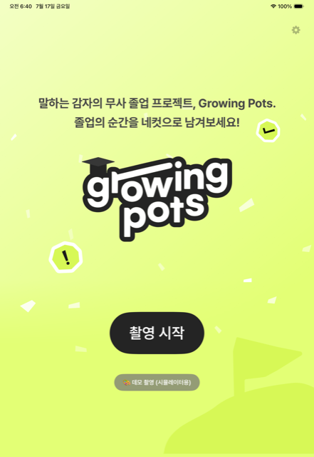
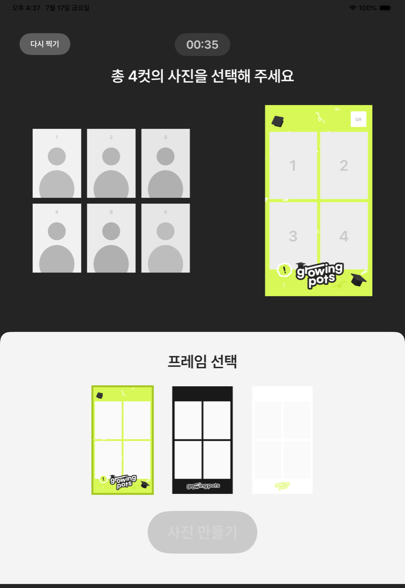
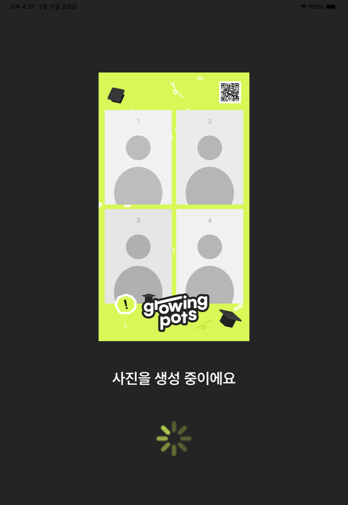
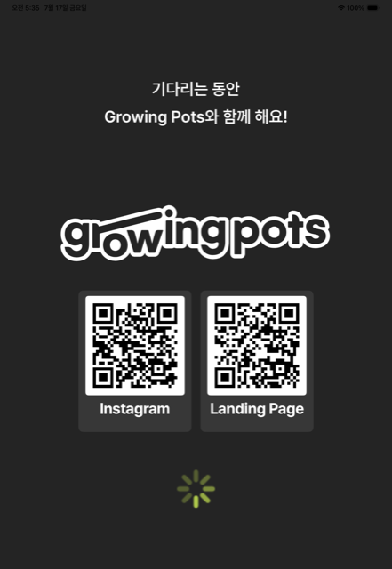
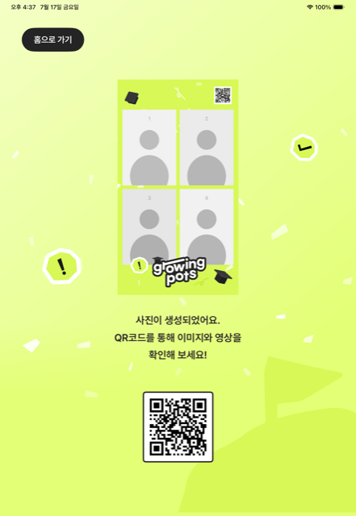
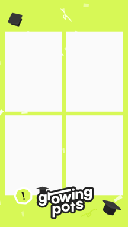
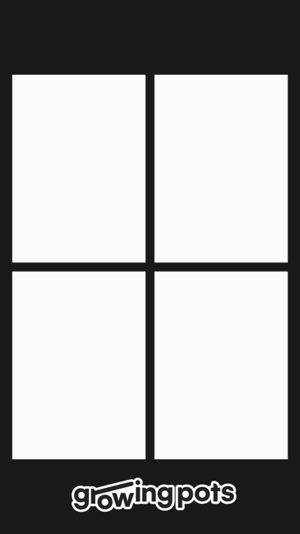
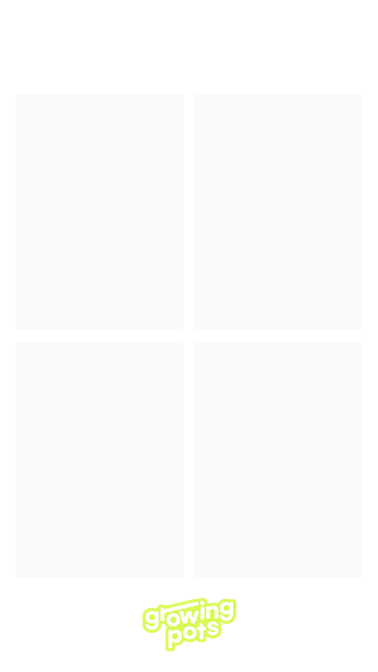
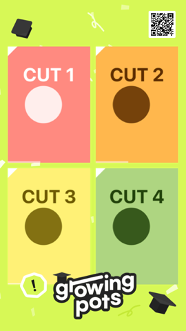
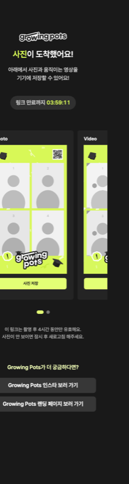

<div align="center">

# 🎓 growing pots

**말하는 감자의 무사 졸업 프로젝트 — 아이패드 인생네컷 부스**

전면 카메라로 6컷을 자동 촬영하고, 4컷을 골라 프레임에 합성한 뒤,
QR 하나로 사진과 '움직이는 네컷' 영상을 나눠 갖는 셀프 포토부스입니다.

[](#2-앱-실행-아이패드--아이폰)
[](#디자인)
[](#1-공유-서버)
[](https://4-cut.growingpots.kr)

</div>

---

## 화면

| 홈 | 선택 (40초) | 생성 중 | 대기 | 완료 |
|:---:|:---:|:---:|:---:|:---:|
|  |  |  |  |  |

**흐름:** 촬영 시작 → 전면 카메라 5초 타이머 × **6컷** 자동 촬영(컷마다 영상 동시 녹화) → **4컷 선택 + 프레임 선택** (40초 제한, 만료 시 자동 진행) → 합성(우상단 QR 포함) → 생성 3초·대기 3초 화면을 거쳐 → 완료 화면 QR → 휴대폰으로 스캔하면 **4시간 임시 링크**에서 사진·영상 저장.

### 프레임 & 결과물

| 라임 | 블랙 | 화이트 | 합성 결과 | 모바일 웹 |
|:---:|:---:|:---:|:---:|:---:|
|  |  |  |  |  |

QR로 열리는 웹 페이지는 사진/영상 **스냅 캐러셀**로, 저장 버튼과 함께 Instagram·랜딩 페이지 링크를 제공합니다.

## 구조

```
growingcut/
├── ios/                 # 아이패드 앱 (SwiftUI, iOS 17+, 세로 고정)
│   ├── GrowingCut.xcodeproj
│   ├── GrowingCut/
│   │   ├── App/         # 앱 진입점, 화면 흐름 상태 (6컷·40초 규칙)
│   │   ├── Views/       # 홈 / 촬영 / 선택 / 결과(생성중·대기·완료) / 설정
│   │   ├── Camera/      # AVCaptureSession (사진 + 클립 동시 캡처)
│   │   ├── Rendering/   # 네컷 합성 코어 (iOS/macOS 공용, UIKit 무의존)
│   │   ├── Networking/  # 업로드 클라이언트 (X-GC-Key)
│   │   └── Resources/   # 프레임 오버레이 PNG · UI 에셋 · Pretendard 폰트(OFL)
│   └── Support/Info.plist
├── server/              # LAN 데모용 공유 서버 (Node 18+, 무의존)
├── vercel/              # 프로덕션 공유 서버 (Vercel Functions + Blob)
├── tools/               # macOS 검증 도구 (기기 없이 합성 코어 검증)
└── docs/images/         # README 갤러리
```

## 디자인

Figma 시안(iPad Pro 11" 세로, 834×1194)을 **좌표 1:1**로 재현했습니다.

- **토큰**: lime-400 `#E3FF75` · lime-500 `#D7F856` · lime-600 `#C4E936` · gray-800 `#242424` · gray-900 `#191919`, **Pretendard** (번들, OFL)
- **`ScaledStage`**: 모든 화면은 834×1194 고정 캔버스에 Figma 좌표 그대로 그려지고 기기에 맞춰 통째로 스케일됩니다 (풀블리드, 상태바 포함)
- **프레임 = 오버레이 PNG**: 사진 슬롯 4개(각 480×675.5)와 QR 창이 투명하게 뚫린 1080×1920 PNG. 렌더러가 *사진 → 오버레이 → QR* 순서로 그립니다. **프레임 추가 = PNG 1장 + 썸네일 + `FrameStyle.all` 1줄**

## 실행 방법

### 1) 공유 서버

프로덕션은 **https://4-cut.growingpots.kr** 에 배포돼 있습니다 (앱 기본값 — 설정 불필요).

| | 로컬 서버 (`server/`) | Vercel (`vercel/`) |
|---|---|---|
| 요건 | 맥 + 같은 와이파이 | — (배포됨) |
| QR 접속 | 같은 와이파이에서만 | **어디서든 (셀룰러 포함)** |
| 만료 처리 | 접근 시 410 + 30분 주기 정리 | 접근 시 410 + 즉시 삭제 + 일일 크론 |

<details>
<summary><b>Vercel 배포/운영 상세</b></summary>

```bash
cd vercel
npx vercel deploy --prod
```

- 1회 설정: 대시보드 → Storage → **Blob store 연결** (`BLOB_READ_WRITE_TOKEN` 자동 주입)
- 환경변수: `GC_UPLOAD_KEY`(업로드 보호 — **설정됨**, 기기 ⚙️에 같은 키 입력), `TTL_HOURS`(기본 4), `CRON_SECRET`, `GP_INSTAGRAM_URL`/`GP_LANDING_URL`(웹 푸터 링크 재정의)
- 영상은 서버리스 본문 한도(4.5MB) 안에 들도록 비트레이트 캡 (5초 ≈ 2.2MB)
- **Hobby 플랜 참고**: Blob 고급 연산을 아끼도록 업로드는 `put` 1회(결정적 경로+덮어쓰기), 페이지 조회는 `head` 2회로 동작 — 월 2K 한도 기준 **~1,000세션**. 한도 초과 시 하드 차단(30일)이므로 행사 전 대시보드 Usage 확인 권장. 크론은 Hobby 제한(1일 1회)에 맞춰 daily

</details>

<details>
<summary><b>로컬 LAN 서버로 데모</b></summary>

```bash
node server/server.js
# 출력된 주소(예: http://192.168.0.10:8787)를 앱 ⚙️에 입력
```

인증 없는 같은-와이파이 데모용입니다. 공용 인터넷에 노출하지 마세요.

</details>

### 2) 앱 실행 (아이패드 / 아이폰)

1. `ios/GrowingCut.xcodeproj`를 Xcode 16+로 열고 팀만 선택해 실행
2. 서버 주소는 기본값으로 프로덕션에 연결됨 — **업로드 키만 ⚙️에서 1회 입력** (운영자에게 문의)
3. 시뮬레이터에는 카메라가 없으므로 홈의 **데모 촬영** 버튼으로 전체 흐름 확인

<details>
<summary><b>CLI로 빌드/설치</b></summary>

```bash
cd ios
# 시뮬레이터
xcodebuild -project GrowingCut.xcodeproj -target GrowingCut \
  -configuration Debug -sdk iphonesimulator CODE_SIGNING_ALLOWED=NO build

# 실기기 (공유 스킴 필수 — -target은 기기 등록을 건너뜀)
xcodebuild -project GrowingCut.xcodeproj -scheme GrowingCut -configuration Debug \
  -sdk iphoneos -destination 'generic/platform=iOS' -derivedDataPath build/dd \
  DEVELOPMENT_TEAM=<팀ID> -allowProvisioningUpdates build
xcrun devicectl list devices
xcrun devicectl device install app --device <식별자> build/dd/Build/Products/Debug-iphoneos/GrowingCut.app
```

</details>

## 촬영 규칙 (기본값)

| 항목 | 값 | 위치 |
|---|---|---|
| 촬영 컷 수 | 6컷 × 5초 타이머 | `AppModel.shotCount` / `countdownSeconds` |
| 선택 | 4컷, **40초 제한** (만료 시 자동 채움) | `AppModel.pickCount` / `selectionSeconds` |
| 결과 화면 | 생성 최소 3초 → 대기 최소 3초 → 완료 | `ResultView.DisplayStep` |
| 링크 유효 시간 | 4시간 | 서버 `TTL_HOURS` |
| 이미지 | 1080×1920 JPEG, QR 우상단 (862.84, 63) | `LayoutSpec` |
| 영상 | 540×960 30fps H.264, 길이 = 가장 짧은 클립 | `VideoComposer` |

## 검증 도구 (macOS)

렌더링 코어가 UIKit 무의존이라 기기 없이 맥에서 검증합니다.

```bash
# 오버레이 알파 검증 + 스틸 3종 + 움직이는 네컷 + QR 디코드
xcrun swiftc -parse-as-library -O -o /tmp/preview tools/preview.swift ios/GrowingCut/Rendering/*.swift
/tmp/preview /tmp/preview-out ios/GrowingCut/Resources/Frames

# 영상 길이/크기/프레임 확인, 이미지 QR 디코드
xcrun swiftc -parse-as-library -O -o /tmp/probe tools/probe.swift
/tmp/probe <영상.mp4> <출력 디렉터리>
/tmp/probe --qr <이미지.jpg>

# 시뮬레이터 자동 데모 (UI 조작 없이 파이프라인 완주)
xcrun simctl launch <UDID> com.growingcut.app -autoDemo     # 결과 화면까지
xcrun simctl launch <UDID> com.growingcut.app -demoSelect   # 선택 화면까지
```

## 구현 노트

- **영상 합성은 AVAssetReader → CoreImage → AVAssetWriter 직접 파이프라인.** `AVMutableComposition`+CoreAnimationTool은 iOS/macOS 26에서 deprecated이고 CLI에서 동작하지 않아(-11800/-12780) 전 플랫폼 검증 가능한 인프로세스 방식을 사용. 회전·미러 클립 복원은 preview 도구의 저장 케이스로 검증됨
- **전면 카메라 산출물은 미리보기(셀피)와 동일하게 미러링** 저장
- 업로드는 `PUT /api/s/:id/photo|video` 두 번이 전부 — 실패 시 같은 ID 재시도로 QR(이미지에 박힌 링크)이 그대로 유효
- Figma 그라데이션의 CSS 내보내기는 실렌더와 다를 수 있음 — 흰 워시는 노드 단독 캡처 기준으로 보정됨
- `Info.plist`의 `NSAllowsArbitraryLoads`는 LAN http 데모용 — 실서비스만 쓸 거면 좁힐 것

---

<div align="center">
<sub>🥔 감자들의 무사 졸업을 기원합니다 · Figma 시안 1:1 · Pretendard(OFL) 동봉</sub>
</div>
